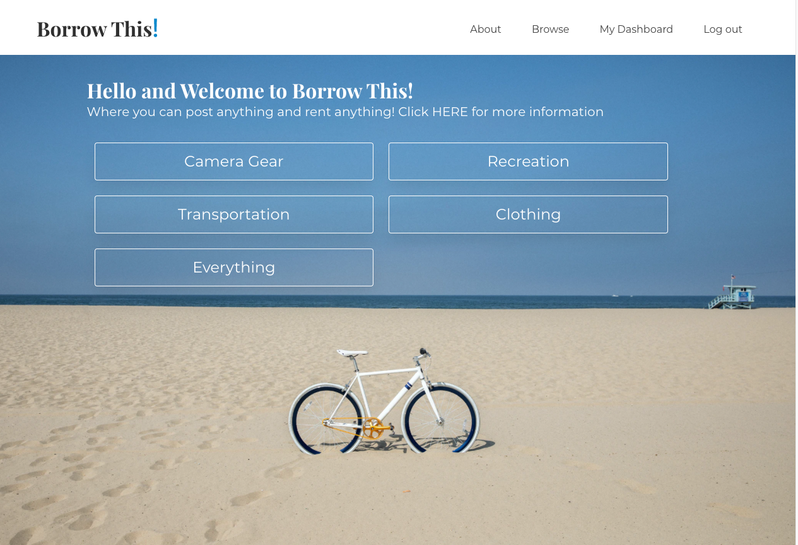
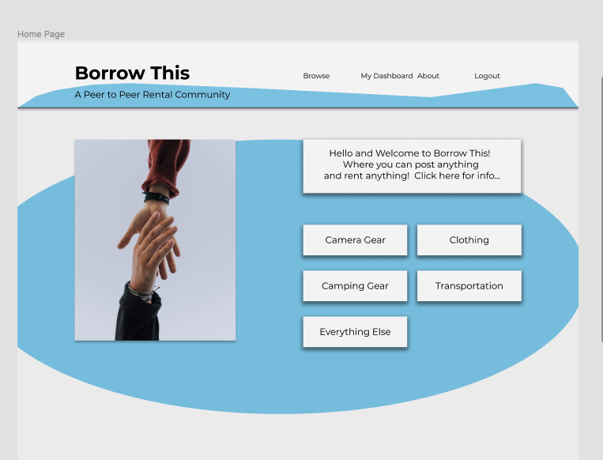
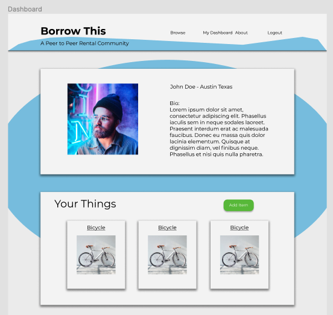
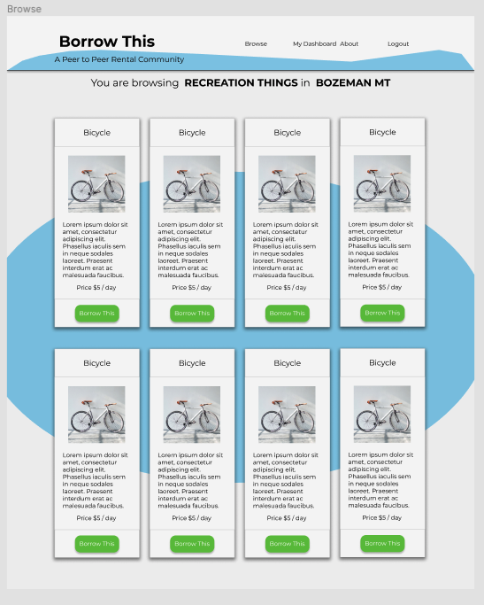
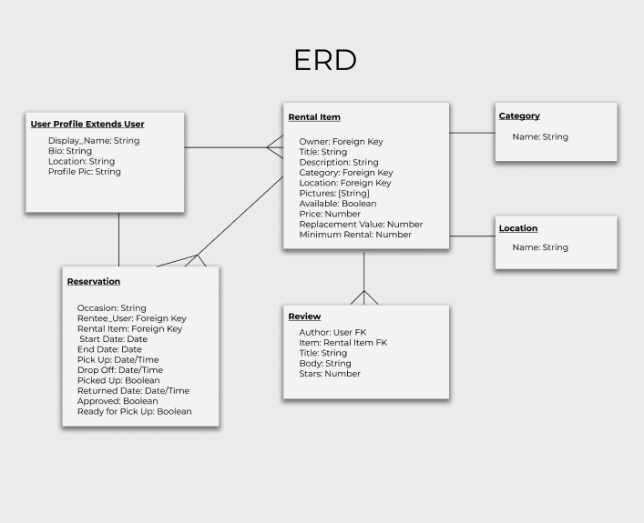

# [Borrow This](https://borrow-this.herokuapp.com/)
A Peer to Peer Rental Community



## Scope:
Build a web application similar to craigslist, sharegrid, or AirBnB where users can post items for rent and make reservations for those items. In addition users can decide how much money they want to charge, whether to approve reservations, and give reviews for items on the website.  

## Wireframes:
#### Home

#### User Dashboard

#### Browse


## [Figma Wireframes Link](https://www.figma.com/file/wD8z1SBVXa3xsu1Xz7D43L/P2P-Rental-Community?node-id=1%3A2)

## User Stories:
- A user creates a profile upon signing up.  This includes a profile image, a bio, and location.  
- A user may browse through items for rent by visiting the browse page.  They can filter by or category or location.
- A user may select an item and visit the item’s detail page.  
- A user may select an item to rent and they are brought to a reservation form page where they can fill out the needed information to rent the item.  They can then submit their reservation.  
- A user may see their reservation on their dashboard page.  They can edit or cancel the reservation.  
- A user may update their information on their dashboard page.  A User may delete their account.  
- A user may choose to add a rental item by clicking on a link in their dashboard page where they will be brought to a form.  On this form they can upload images and all the details about the item they want to rent.
- A user can view their rental items on their dashboard.  They can see if an item is rented or they can change the status of their item to unavailable.  They can delete their item from the website.  
- A User can see past reservations as well.  
- A user can visit another user’s page via a link on a rental item or reservation.
- A user may visit the website and see items for rent but if they are not signed in, they cannot make a reservation.  
- A User cannot make a reservation for an item that is already reserved or out.




## Reservation Validation
Something I am particularly proud of other than all the functionality this site has to offer is the validations I created for the make and update reservations.  The biggest hurdle was creating a validation that would prevent double booking of a rental item.  From there I kept adding more validations as they made sense.  

```python
#  Validate New Rez

def validate_rez(today, item_id, length, start, end):
    if start < today:
        return "You cannot make reservations for the past, please speak with admin"
    if start > end:
        return 'Your start date must be before your end date'
    rental_period = end-start
    rental_period = rental_period.days
    if rental_period < length:
        return f"You must rent this item for at least {length} days"
    rez_list = Reservation.objects.filter(item_id=item_id)
    for booking in rez_list:
        if end >= booking.start_date:
            if start <= booking.end_date:
                return 'Sorry!  Those dates overlap with a current reservation'
    return ''

```
## Unresolved Problems
There are still more validations to figure out to make the web application more battle proof for people to make reservations.  Aside from that, there are not many unresolved problems.  

## Future Features
- browse page by default goes to user's location rather than all locations
- I would love to see a google maps implementation as well as chat so that users can discuss a reservation.  
- I would like for users to upload multiple pictures for items and have a carousel on the item details page.  
- A search bar for items.  
- A model and system in place to handle if an item is lost or damaged.  


## Technologies:
- Web Framework: Django
- CSS Library: Bulma
- Templates: Django Templating Language
- Database: PostgreSQL
- Heroku for Deployment

## Runtime Language
- python-3.7.7

## Dependencies
(some of these I downloaded while playing with sockets so they may not be necessary to run the app)
- asgiref==3.2.10
- dj-database-url==0.5.0
- Django==3.1
- django-on-heroku==1.0.1
- gunicorn==20.0.4
- monotonic==1.5
- psycopg2==2.8.5
- psycopg2-binary==2.8.5
- python-engineio==3.13.2
- python-socketio==4.6.0
- pytz==2020.1
- six==1.15.0
- sqlparse==0.3.1
- whitenoise==5.2.0

